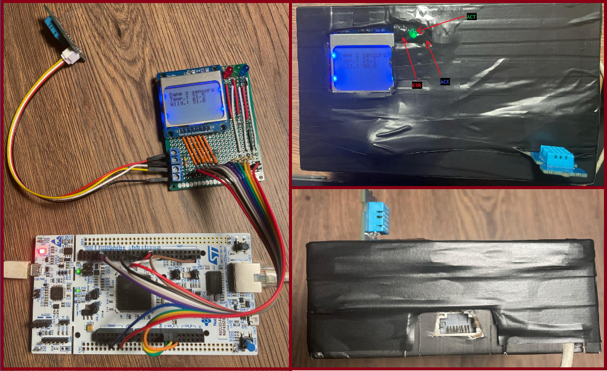
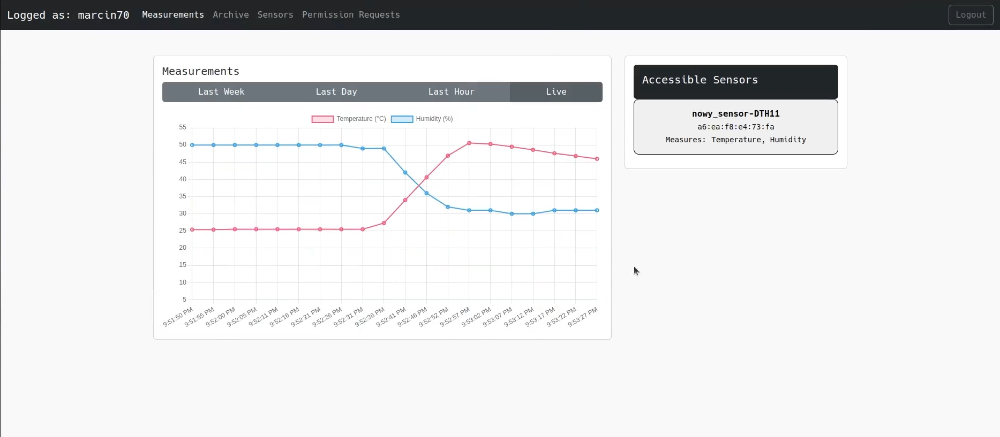
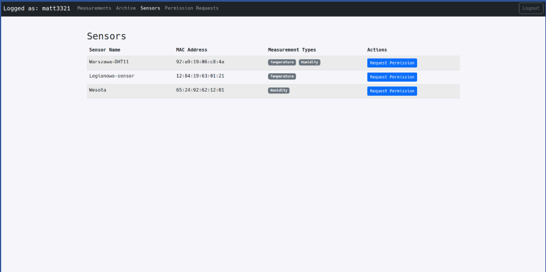
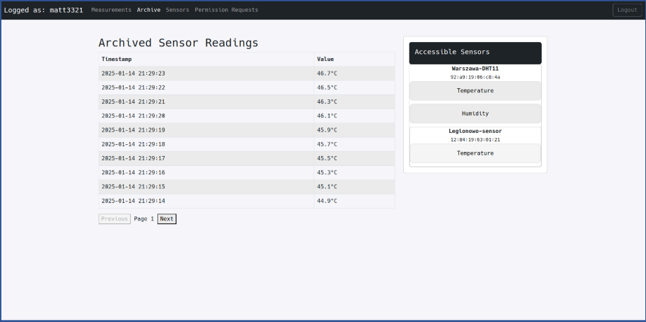

# Projekt Zespołowy 2 - Sensor

Skład zespołu:
- *Maciej Scheffer*
- *Michał Pałasz*
- *Bartosz Nowak*
- *Łukasz Suchołbiak*

Właściciel tematu/mentor zespołu: ***dr hab. inż. Krzysztof Cabaj***

## Cel Projektu
Celem projektu jest zrealizowanie systemu umożliwiającego automatyczne pomiary parametrów
środowiskowych (temperatura, wilgotność). Uzyskane z sensorów pomiary będą przesyłane w bezpieczny
sposób przez sieć do centralnej bazy danych. System ma posiadać interfejs webowy umożliwiający bieżącą
obserwację zebranych pomiarów historycznych oraz wykrywanie niepokojących zdarzeń – np. gwałtowne
zwiększenie temperatury.

## Zdjęcia

